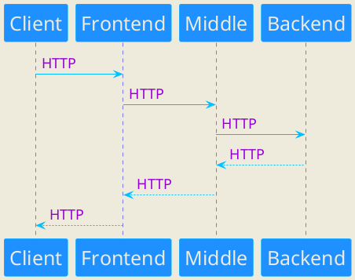
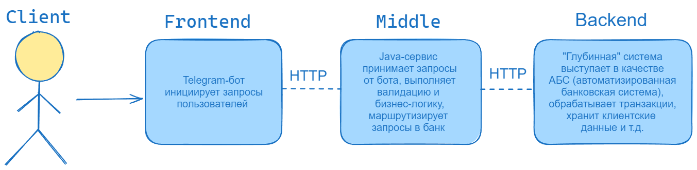

# Middle service
Middle service является вторым компонентом проекта "Мини-банк". Сервис взаимодействует с остальными частями проекта: Frontend компонентом (Telegram-бот) и Backend компонентом (АБС).
В функции сервиса входят принятие и валидация запросов от бота, выполнение бизнес-логики и маршрутизация запросов в АБС.





### Локальный запуск
1. Склонировать проект:
   ```
   git clone https://github.com/gpb-it-factory/satvaldiev-middle-service.git
   ```
2. Перейти в корневую папку проекта ___satvaldiev-telegram-bot___
3. Выполнить команду:
   ```
   ./gradlew bootRun
   ```
4. Запустить первый компонент проекта "Мини-банк" согласно README:
   ```
   https://github.com/gpb-it-factory/satvaldiev-telegram-bot.git
   ```

### Поддерживаемые команды сервиса
- ___/register___ (ответ - "Поздравляем! Вы стали клиентом нашего банка")
- ___/createaccount___ (ответ - "Поздравляем! Вы открыли счет "Акционный" с 5000 рублей в подарок! Информируем Вас, что
    при смене Вами своего имени пользователя в Telegram, вы незамедлительно должны оповестить нас
    при помощи команды ___/updateusername___")
- ___/currentbalance___ (ответ - "5000.00")
- ___/transfer___ \[toUserName] \[2000.00] (ответ - "Перевод средств выполнен успешно. ID транзакции: UUID")