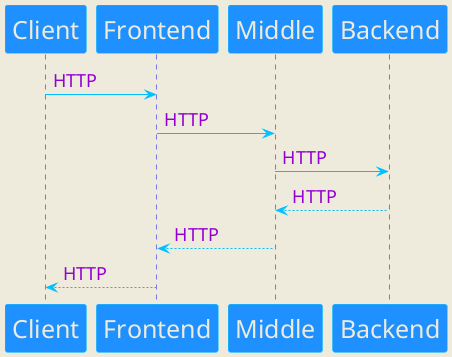

# Middle service
Middle service является вторым компонентом проекта "Мини-банк". Сервис взаимодействует с остальными частями проекта: Frontend компонентом (Telegram-бот) и Backend компонентом (АБС).
В функции сервиса входят принятие и валидация запросов от бота, выполнение бизнес-логики и маршрутизация запросов в АБС.

### Локальный запуск
Раздел в разработке